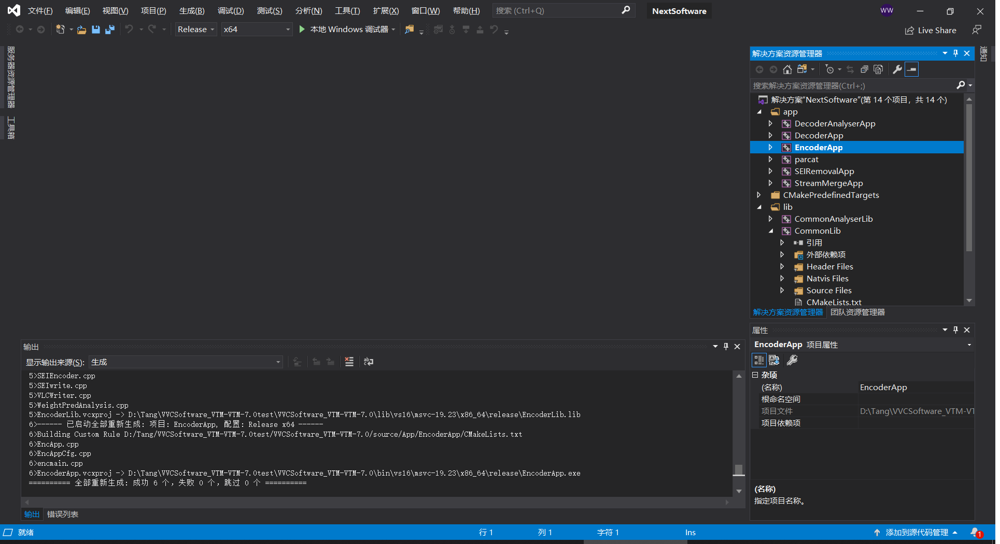
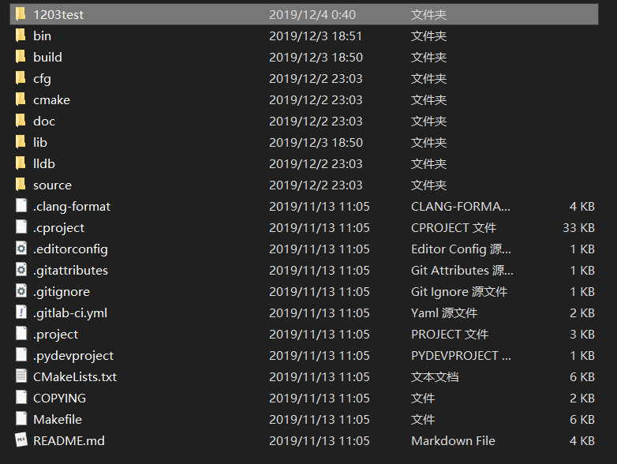
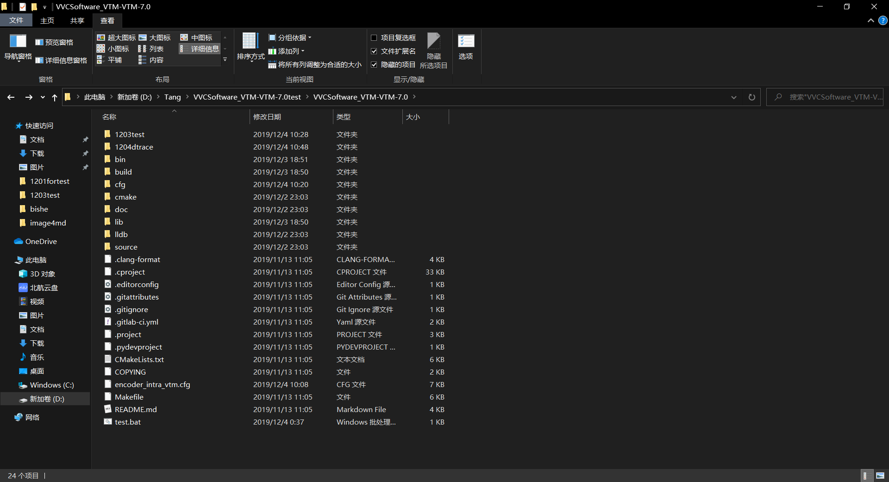

# VTM&Dtrace简要使用教程（仅Windows）

## 1 . 下载源代码和所需工具

​	从[官方GitLab](https://vcgit.hhi.fraunhofer.de/jvet/VVCSoftware_VTM/tree/VTM-7.0)下载VTM源程序推荐下载zip；该程序需要cmake工具，可从[cmake官网](http://www.cmake.org/ )下载；以及[Visual Studio](https://visualstudio.microsoft.com/vs/?rr=https%3A%2F%2Fwww.baidu.com%2Flink%3Furl%3Dbr3-CSGLFtinKR8PZu3SbWp57RUtSaMRCNMvzmcrx2TNTr0WSXAOTk8zrWIta8HOBdXPThzA99c-kd0ROt-R__%26wd%3D%26eqid%3Db8f5cec300073c4d000000035de54489)，社区版即可。

​	解压下载好的源代码，如下图所示

## 2.  cmake生成工程

​	以下cmake步骤参考官方文档的windows部分。

​	首先打开windows的powershell:"Win+R"打开运行，输入”powershell“，确定，即可进入Windows Powershell”

打开解压后的文档，右键任意一个文件夹，点击属性

从其位置栏处获得其路径

在命令行中利用"cd"命令在命令行中切换到该路径下

继续利用“mkdir”命令，建立build文件夹，具体命令及建立成功后界面如下图所示

cd到build目录，利用cmake命令实现Visual Studio工程的生成

`cmake .. -G "Visual Studio 16 2019"`

回车，生成成功后的界面如下

得到的build文件夹中的文件如下图所示

双击"NextSoftWare.sln"，即可打开VisualStudio工程

##  3.VTM的使用 

首先以实现编码功能为例，将上面的运行编译方式设置为Release

右键EncoderApp 点击设为启动项目

再次右键单击，选择重新生成

打开VTM文件下的bin文件夹，一直打开知道release文件夹，看见EncoderApp

在进行编码之前要对编码参数进行配置，首先要获得进行编码的视频。VVC  VTM使用的视频与HEVC相同，点击[视频下载链接](https://pan.baidu.com/s/1LKHyC3JxBM2-svmR-l_BEQ) ,提取码为：gfhh 

这里选用BasketballDrill_832x480_50.yuv进行编码

在VTM根目录新建一个文件夹，用于存放编码所需的文件。

将上面生成的Encoder.App和用于编码的视频序列放入上述新建的文件夹中

接下来打开VTM根目录中的cfg文件夹

打开cfg文件夹如下图所示

其中下面四个cfg为主要的配置文件，从上到下分别对应AI(全帧内)，LDP（低延迟P），LDB（低延迟B），randomacess（随机接入）。这里选择AI模式作为主要编码。接下来打开per-sequence文件夹，找到与上述视频序列同名的cfg文件

右键使用Notepad++进行编辑

将上图第一行InputFile参数更改为视频序列所在的绝对路径，将倒数第二个参数FrameToBeEncoded更改为40（少处理几帧，速度会快一些。

将上述内容复制到encoder_intra_vtm.cfg最前方（BitstreamFile前），其中BitStreamFile为编码后输出的文件名，ReconFile为解码后输出的文件名

将上述更改后的encoder_intra_vtm.cfg复制到之前配置好的文件夹（1203test）中

接下来编写一个批处理文件实现编码程序的运行，新建文本文档

打开界面上方的查看栏，将文件扩展名勾选上

如上如所示，将新建的文本文档命名为test.bat

利用Notepad++编辑test.bat，键入如下代码

` EncoderApp.exe -c D:\Tang\VVCSoftware_VTM-VTM-7.0test\VVCSoftware_VTM-VTM-7.0\1203test\encoder_intra_vtm.cfg >output.txt
pause `

其中 -c 表示编码，-c后为配置文件所在绝对路径，output.txt将存放程序运行时的输出参数，pause功能同Visual Studio中的` system("pause") `

保存，双击运行test.bat文件，正在运行中的界面如下图所示

耐心等待一会直到其运行完毕，运行成功界面如下图所示

运行后的界面如下，其中str.bin为编码后的二进制文件

打开output.txt可以看到运行的输出

可以看到运行时间为228.409s

## 4. VTM Dtrace工具跟踪分块结果

VTM自带的Dtrace功能可以实现对编码解码过程中各种数据的跟踪，需要拿出上面生成的str.bin文件，在VTM根目录中再新建一个文件夹,并将str.bin放入1204dtrace中

再次打开NextSoftware工程，将DecoderAnalyserApp设为启动项，在其上方搜索栏搜索ENABLE_TRACING

将其修改为1

右键DecoderAnalyserApp，选择属性→调试，更改其工作目录到之前新建的文件夹1204dtrace

按照官方手册的说明(doc文件夹中的software-manual)，设置命令参数

` -b str.bin --TraceFile="vtm7.0_basket.vtmbmsstats" --TraceRule="D_BLOCK_STATISTICS_ALL:poc>=0" `

进入属性→常规，更改输出目录为1204dtrace，确定保存

右键DecoderAnalyserApp，选择清理，清理完毕后选择重新生成，等待生成完毕，生成完毕后运行，运行成功后结果如下图所示

1204dtrace中生成的vtmbmsstats文件即为统计信息

该格式文件可用官方提供的YUView查看，点击[链接](https://github.com/IENT/YUView)可下载

YUView打开原始视频序列和生成的统计信息，新建overlay，并将两个都拖入

勾选右边不同的参数即可查看不同的分块信息

按照右面参数设置，可以用重叠的形式查看分块信息

